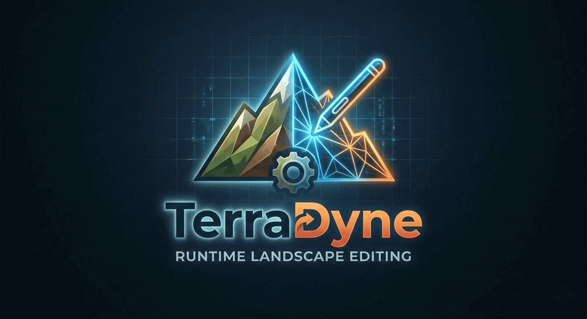

# 🌍 TerraDyne 0.3

> Turn an authored Unreal Landscape into a persistent, runtime-editable world without switching to voxels.

<p align="center">
  
</p>

TerraDyne is an MIT-licensed Unreal Engine 5.7 plugin for teams building survival, sandbox, and open-world games on top of Unreal Landscapes. It starts from the world you already authored, converts that terrain into a runtime-managed framework, and then layers persistence, replication, population state, procedural extension, and gameplay hooks on top.

## 🚀 Start Here

| What you need | Link |
|---|---|
| Commercial build on Fab | [🛒 TerraDyne on Fab](https://www.fab.com/listings/20f72d71-9737-4ac1-bce5-034eca166529) |
| Setup and usage manual | [📘 TerraDyne Manual](https://gregorigin.com/Terradyne/) |
| Demo walkthrough | [🎬 DEMO.md](DEMO.md) |
| Release notes | [🧾 CHANGELOG.md](CHANGELOG.md) |
| Runtime-world docs | [🗺️ docs/runtime-world-framework.md](docs/runtime-world-framework.md) |

## 🧭 What TerraDyne Does

```text
Authored Unreal Landscape
          ↓
Landscape conversion + foliage transfer + paint capture
          ↓
Persistent runtime terrain
          ↓
Population state + procedural outskirts + gameplay hooks
```

This repo is no longer just a terrain deformation prototype. TerraDyne now targets a broader runtime world workflow:

- 🏞️ keep the authored Landscape pipeline
- ✏️ sculpt and paint terrain at runtime
- 🌿 carry over foliage and actor foliage
- 💾 save and restore world state
- 🌐 replicate terrain and world metadata
- 🧱 plug into survival and sandbox gameplay systems

## ✨ Highlights

- 🏗️ **Authored world conversion**
  Landscape import, paint layer capture, placed foliage transfer, actor foliage transfer, save/load, and replicated chunk state.
- ⛏️ **Runtime terrain editing**
  Raise, lower, smooth, flatten, paint layers, undo/redo, and runtime tool controls.
- 🌲 **Persistent world population**
  Register placed actors, place new runtime actors, persist harvest and destruction state, and restore regrowth-ready entries from saves.
- 🧬 **Procedural extension**
  Seeded outskirts, biome overlays, runtime spawn rules, optional edge growth, and PCG-ready point export.
- 🎮 **Gameplay hooks**
  Navmesh dirtying, AI spawn zone queries, build-permission checks, biome queries, Blueprint APIs, and terrain/foliage/population change delegates.
- 🧰 **Designer workflow**
  World presets, scene setup templates, and a full feature showcase flow for first-run evaluation.
- 🖼️ **Hybrid visual path**
  CPU-authoritative terrain with optional render-target-assisted visuals layered on top.

## 👥 Who It Is For

- Survival games that need editable terrain plus persistent world state
- Sandbox builders that want authored terrain instead of a voxel-first workflow
- Open-world prototypes that need runtime hooks for AI, spawning, and permissions
- Unreal teams who want Landscape-based production workflows with gameplay-friendly runtime systems

## 🛠️ Requirements

- Unreal Engine `5.7`
- `GeometryScripting`
- `VirtualHeightfieldMesh`
- `Win64` is the currently packaged and validated target in this repository

## 📦 GitHub Or Fab?

| Option | Best for |
|---|---|
| **GitHub repo** | Source-first access, MIT license, and direct inspection of the runtime-world framework code |
| **Fab version** | [Commercial distribution](https://www.fab.com/listings/20f72d71-9737-4ac1-bce5-034eca166529), polished marketplace delivery, and the version intended for users who want the store build |

## 🚀 Installation

1. Copy the `TerraDyne` plugin folder into your project's `Plugins/` directory.
2. Enable `GeometryScripting` and `VirtualHeightfieldMesh`.
3. Regenerate project files.
4. Build the `Development Editor` target for your project.

## 🎮 Quick Start

1. Add `BP_TerraDyneManager` if you want direct terrain control.
2. Add `ATerraDyneSceneSetup` if you want a template-driven setup flow.
3. Choose a scene template:
   `Full Feature Showcase`, `Sandbox`, `Survival Framework`, or `Authored World Conversion`.
4. Import an authored Landscape or initialize a runtime world directly.
5. Press Play and use the TerraDyne panel to sculpt, paint, save/load, or run the showcase flow.

## 📚 Documentation Map

- `README.md` → product overview and entry point
- `DEMO.md` → showcase sequence and demo templates
- `CHANGELOG.md` → release history
- `docs/runtime-world-framework.md` → population, procedural, and gameplay-layer APIs

## ✅ Validation

- `TerraDyneEditor` builds cleanly on Unreal Engine 5.7
- `Automation RunTests TerraDyne` passes with 16 TerraDyne tests

## 🔗 Useful Links

- [🛒 Fab version](https://www.fab.com/listings/20f72d71-9737-4ac1-bce5-034eca166529)
- [📘 TerraDyne Manual](https://gregorigin.com/Terradyne/)

## 📝 License

MIT. Code by Andras Gregori.
